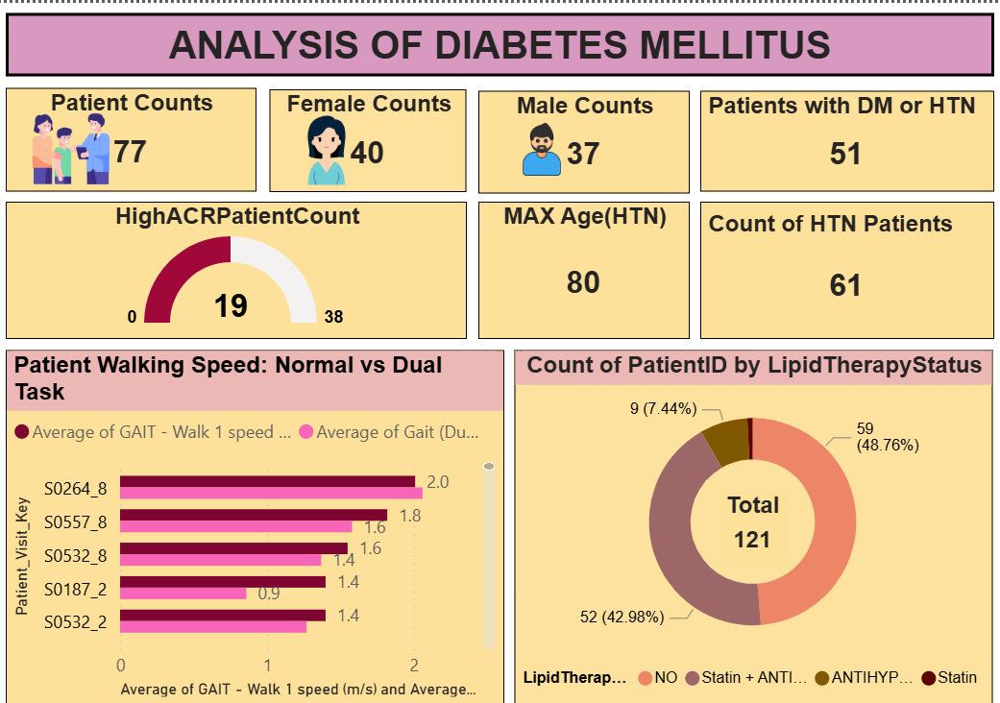
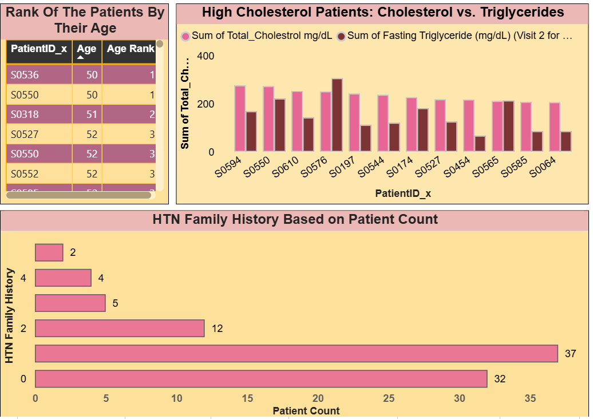
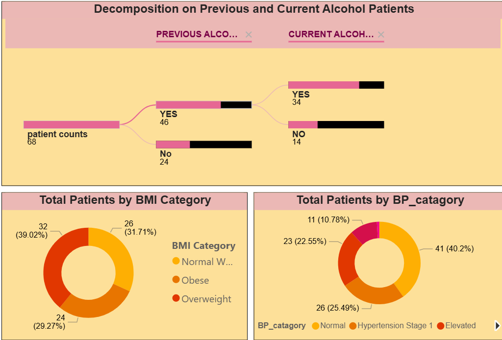

# Cerebromicrovascular Disease in Elderly Patients with Diabetes: A Data-Driven Healthcare Analytics Study

This project showcases an end-to-end healthcare data analytics solution built using Power BI to examine the relationship between diabetes mellitus, vascular complications, cognitive performance, and mobility outcomes. The analysis evaluates how diabetes duration, glycemic control, and diabetic retinopathy severity affect neurological and physical functioning through interactive, insight-driven dashboards.

The solution leverages Power BI data modeling, DAX measures, and advanced visualization techniques to integrate metabolic indicators (HbA1c, cholesterol, blood pressure), ophthalmological findings (retinopathy severity stages), and functional metrics (cognitive scores, gait stability). By enabling drill-down analysis and cross-filtering across clinical dimensions, the dashboards support trend identification, risk stratification, and data-driven decision-making, demonstrating practical analytics skills applicable to real-world healthcare and business intelligence use cases.

## Dataset Characteristics & Analytics Scope

- **Sample Size:** 77 patients analyzed across multiple clinical visits, modeled using a star-schema–style data structure in Power BI to support scalable analytics
- **Key Variables:** 100+ clinical and functional attributes, including diabetes duration, HbA1c levels, diabetic retinopathy severity, cognitive domain scores, blood pressure trends, lipid profiles, and gait stability metrics, transformed into analytical fact and dimension tables
- **Analysis Type:** Cross-sectional observational analysis supported by DAX-based correlation, variance, and comparative measures to identify relationships and outcome differences across patient subgroups
- **Visit Structure:** Longitudinal visit design (Visit 2 vs. Visit 8) enabling time-based comparisons, progression tracking, and cohort-level insights using calculated columns and measures

## Power BI & DAX Analytics Toolkit

- **Power BI Desktop:** End-to-end BI dashboard development, data modeling, relationship management, and analytical reporting
- **Power Query (M Language):** ETL workflows including data extraction, transformation, cleansing, normalization, and validation
- **DAX (Data Analysis Expressions):** Development of optimized calculated columns and measures for KPIs, time-intelligence, cohort analysis, and variance reporting
- **Data Visualization & BI Reporting:** Interactive dashboards with drill-through, slicers, cross-filtering, and multi-page reports supporting self-service analytics

## Data Preparation & Transformation Highlights

- **Column Renaming:** Standardized 100+ cryptic fields and included measurement units for clarity
- **Demographic Labeling:** Converted race codes (1–4) to full descriptive names for improved readability
- **Gender Imputation:** Filled missing values using cross-visit lookup logic to ensure data completeness
- **Age Adjustment:** Calculated Visit 8 age based on Visit 2 age plus 2 years for longitudinal consistency
- **Tobacco Use Validation:** Corrected “years used” to 0 where no usage was reported
- **Diabetes Duration Correction:** Assigned 0 for non-diabetic participants to maintain data accuracy
- **Family History Parsing:** Transformed abbreviations (e.g., “f, m”) to full descriptors (“Father, Mother”)
- **History Counts:** Generated numeric fields to facilitate family history correlation analyses
- **ACR Risk Stratification:** Created categorical risk groups (NORMAL, MODERATE, HIGH RISK)
- **Unique Key Creation:** Combined Patient ID and Visit to generate unique identifiers for accurate data modeling

## Comprehensive Analysis of Patient Cohorts

- **Demographics:** Age, gender, race, diabetes duration
- **Disease Prevalence:** Glycemic control, retinopathy, comorbidities
- **Clinical Metrics:** Blood pressure, lipids, kidney function
- **Diabetic vs. Non-Diabetic:** Cognitive, ocular, mobility outcomes
- **Retinopathy Impact:** Cognitive performance differences
- **ACR Risk:** Normal, Moderate, High risk outcomes
- **Combined Risk:** Retinopathy + cognitive decline

## Key Findings 

**1. Demographics & Comorbidities**

- Total Patients Analyzed: 77
- Gender Split: 40 Female, 37 Male
- Patients with Diabetes Mellitus (DM) or Hypertension (HTN): 51
- HTN Patient Count: 61
- Maximum Age (HTN): 80 years
- High ACR Patients: 19 (suggesting renal risk)

**2. Mobility & Therapy Insights**

- **Gait Speed Comparison:** Dual-task walking speeds were generally equal or higher than normal walking speeds, indicating preserved motor-cognitive function in some patients.
- **Statin + Antihypertensive:** 48.76%  
- **No therapy:** 42.98%  
- **Antihypertensive only:** 7.44%

**3. Lifestyle & Risk Factors**

  **Alcohol Consumption (n=68)**
  - **Previously consumed:** 46  
  - **Currently consuming:** 34 (all from previous drinkers)  
  - No new alcohol initiation among non-drinkers

  **BMI Categories**
  - **Overweight:** 39.02%
  - **Normal weight:** 31.71%  
  - **Obese:** 29.27%  

 **Blood Pressure Categories**
 - **Normal:** 40.2%  
 - **Hypertension Stage 1:** 25.49%  
 - **Elevated:** 22.55%
 - **Hypertension Stage 2 (inferred):** 10.78%

**4. Cognitive & Retinal Health**

  **Cognitive Score Distribution (n=121)**
    - **Moderate impairment:** 73  
    - **Mild impairment:** 44  

  **Diabetic Retinopathy (DR)**
    - **No DR:** 71.07%  
    - **Mild DR:** 19.01%  
    - **Severe Proliferative DR:** 8.26%

**5. Age-Based Disease Onset Patterns**

- **HTN Before Diabetes:** 43 patients  
- **HTN After Diabetes:** 86 patients  
- **Simultaneous Onset:** 92 patients  
- **Not Diabetic / Not HTN:** 43 patients

**6. Cholesterol & Family History**

- **High Cholesterol vs Triglycerides:** Several patients show elevated levels in both metrics, notably S0594 and S0550.
- **HTN Family History:**
  - **Most common:** 0 (no history) – 37 patients
  - **Followed by:** 1 relative – 32 patients

**Conclusion**
This Power BI project illustrates how diabetic complications affect metabolic, vascular, eye, and neurological systems. Poor metabolic control drives multisystem decline, while good control supports near-normal function, highlighting the need for early intervention and targeted monitoring. Interactive dashboards provide healthcare stakeholders with actionable insights to improve patient outcomes.

